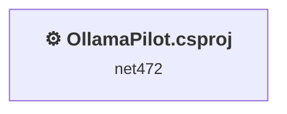
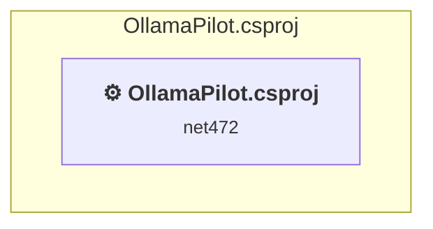

# Projects and dependencies analysis

This document provides a comprehensive overview of the projects and their dependencies in the context of upgrading to .NETCoreApp,Version=v10.0.

## Table of Contents

- [Executive Summary](#executive-Summary)
  - [Highlevel Metrics](#highlevel-metrics)
  - [Projects Compatibility](#projects-compatibility)
  - [Package Compatibility](#package-compatibility)
  - [API Compatibility](#api-compatibility)
- [Aggregate NuGet packages details](#aggregate-nuget-packages-details)
- [Top API Migration Challenges](#top-api-migration-challenges)
  - [Technologies and Features](#technologies-and-features)
  - [Most Frequent API Issues](#most-frequent-api-issues)
- [Projects Relationship Graph](#projects-relationship-graph)
- [Project Details](#project-details)

  - [OllamaPilot.csproj](#ollamapilotcsproj)

## Executive Summary

### Highlevel Metrics

| Metric | Count | Status |
| :--- | :---: | :--- |
| Total Projects | 1 | All require upgrade |
| Total NuGet Packages | 4 | 2 need upgrade |
| Total Code Files | 51 |  |
| Total Code Files with Incidents | 25 |  |
| Total Lines of Code | 7410 |  |
| Total Number of Issues | 911 |  |
| Estimated LOC to modify | 907+ | at least 12.2% of codebase |

### Projects Compatibility

| Project | Target Framework | Difficulty | Package Issues | API Issues | Est. LOC Impact | Description |
| :--- | :---: | :---: | :---: | :---: | :---: | :--- |
| [OllamaPilot.csproj](#ollamapilotcsproj) | net472 | 🟡 Medium | 2 | 907 | 907+ | ClassicWpf, Sdk Style = False |

### Package Compatibility

| Status | Count | Percentage |
| :--- | :---: | :---: |
| ✅ Compatible | 2 | 50.0% |
| ⚠️ Incompatible | 1 | 25.0% |
| 🔄 Upgrade Recommended | 1 | 25.0% |
| ***Total NuGet Packages*** | ***4*** | ***100%*** |

### API Compatibility

| Category | Count | Impact |
| :--- | :---: | :--- |
| 🔴 Binary Incompatible | 866 | High - Require code changes |
| 🟡 Source Incompatible | 5 | Medium - Needs re-compilation and potential conflicting API error fixing |
| 🔵 Behavioral change | 36 | Low - Behavioral changes that may require testing at runtime |
| ✅ Compatible | 6593 |  |
| ***Total APIs Analyzed*** | ***7500*** |  |

## Aggregate NuGet packages details

| Package | Current Version | Suggested Version | Projects | Description |
| :--- | :---: | :---: | :--- | :--- |
| MdXaml | 1.27.0 |  | [OllamaPilot.csproj](#ollamapilotcsproj) | ✅Compatible |
| Microsoft.VisualStudio.SDK | 17.14.40260 |  | [OllamaPilot.csproj](#ollamapilotcsproj) | ✅Compatible |
| Microsoft.VSSDK.BuildTools | 17.14.2120 | 15.7.104 | [OllamaPilot.csproj](#ollamapilotcsproj) | ⚠️NuGet package is incompatible |
| Newtonsoft.Json | 13.0.3 | 13.0.4 | [OllamaPilot.csproj](#ollamapilotcsproj) | NuGet package upgrade is recommended |

## Top API Migration Challenges

### Technologies and Features

| Technology | Issues | Percentage | Migration Path |
| :--- | :---: | :---: | :--- |
| WPF (Windows Presentation Foundation) | 666 | 73.4% | WPF APIs for building Windows desktop applications with XAML-based UI that are available in .NET on Windows. WPF provides rich desktop UI capabilities with data binding and styling. Enable Windows Desktop support: Option 1 (Recommended): Target net9.0-windows; Option 2: Add <UseWindowsDesktop>true</UseWindowsDesktop>. |

### Most Frequent API Issues

| API | Count | Percentage | Category |
| :--- | :---: | :---: | :--- |
| T:System.Windows.Controls.TextBox | 75 | 8.3% | Binary Incompatible |
| T:System.Windows.RoutedEventHandler | 70 | 7.7% | Binary Incompatible |
| T:System.Windows.Input.Key | 56 | 6.2% | Binary Incompatible |
| T:System.Windows.Media.Color | 44 | 4.9% | Binary Incompatible |
| P:System.Windows.Controls.TextBox.Text | 39 | 4.3% | Binary Incompatible |
| T:System.Windows.Media.Colors | 35 | 3.9% | Binary Incompatible |
| T:System.Windows.RoutedEventArgs | 33 | 3.6% | Binary Incompatible |
| T:System.Windows.Controls.ComboBox | 31 | 3.4% | Binary Incompatible |
| M:System.ComponentModel.Design.MenuCommandService.AddCommand(System.ComponentModel.Design.MenuCommand) | 28 | 3.1% | Binary Incompatible |
| T:System.Windows.Media.SolidColorBrush | 27 | 3.0% | Binary Incompatible |
| E:System.Windows.Controls.Primitives.ButtonBase.Click | 26 | 2.9% | Binary Incompatible |
| T:System.Windows.Media.Brush | 25 | 2.8% | Binary Incompatible |
| T:System.Uri | 18 | 2.0% | Behavioral Change |
| P:System.Windows.Input.KeyEventArgs.Key | 14 | 1.5% | Binary Incompatible |
| M:System.Windows.Media.SolidColorBrush.#ctor(System.Windows.Media.Color) | 14 | 1.5% | Binary Incompatible |
| P:System.Windows.Controls.ComboBox.Text | 14 | 1.5% | Binary Incompatible |
| T:System.Windows.Media.Brushes | 13 | 1.4% | Binary Incompatible |
| T:System.Windows.Input.ModifierKeys | 12 | 1.3% | Binary Incompatible |
| T:System.Windows.Controls.ScrollBarVisibility | 12 | 1.3% | Binary Incompatible |
| P:System.Windows.Media.Colors.DarkGoldenrod | 10 | 1.1% | Binary Incompatible |
| T:System.Windows.DataTemplate | 10 | 1.1% | Binary Incompatible |
| T:System.Net.Http.HttpContent | 9 | 1.0% | Behavioral Change |
| P:System.Windows.Controls.Control.Foreground | 9 | 1.0% | Binary Incompatible |
| P:System.Windows.Media.Colors.SeaGreen | 9 | 1.0% | Binary Incompatible |
| T:System.Windows.Controls.TextBlock | 9 | 1.0% | Binary Incompatible |
| T:System.Windows.Controls.Button | 7 | 0.8% | Binary Incompatible |
| P:System.Windows.FrameworkElement.Tag | 7 | 0.8% | Binary Incompatible |
| T:System.Windows.Controls.ScrollViewer | 6 | 0.7% | Binary Incompatible |
| P:System.Windows.Media.Colors.Gray | 6 | 0.7% | Binary Incompatible |
| T:System.Windows.Controls.CheckBox | 5 | 0.6% | Binary Incompatible |
| P:System.Windows.Media.Brushes.SeaGreen | 5 | 0.6% | Binary Incompatible |
| P:System.Windows.Controls.Primitives.Selector.SelectedItem | 5 | 0.6% | Binary Incompatible |
| P:System.Windows.Media.Brushes.OrangeRed | 5 | 0.6% | Binary Incompatible |
| P:System.Windows.Controls.ItemsControl.ItemsSource | 5 | 0.6% | Binary Incompatible |
| T:System.Windows.Input.Keyboard | 4 | 0.4% | Binary Incompatible |
| P:System.Windows.Input.Keyboard.Modifiers | 4 | 0.4% | Binary Incompatible |
| F:System.Windows.Controls.ScrollBarVisibility.Hidden | 4 | 0.4% | Binary Incompatible |
| M:System.Windows.Media.Color.FromRgb(System.Byte,System.Byte,System.Byte) | 4 | 0.4% | Binary Incompatible |
| T:System.Windows.Media.FontFamily | 4 | 0.4% | Binary Incompatible |
| T:System.Windows.Visibility | 4 | 0.4% | Binary Incompatible |
| T:System.Windows.Input.MouseWheelEventHandler | 4 | 0.4% | Binary Incompatible |
| P:System.Windows.Controls.TextBlock.Text | 4 | 0.4% | Binary Incompatible |
| M:System.Net.Http.HttpContent.ReadAsStreamAsync | 3 | 0.3% | Behavioral Change |
| P:System.Windows.RoutedEventArgs.Handled | 3 | 0.3% | Binary Incompatible |
| M:System.Windows.UIElement.Focus | 3 | 0.3% | Binary Incompatible |
| P:System.Windows.Media.TextFormatting.TextRunProperties.FontRenderingEmSize | 3 | 0.3% | Binary Incompatible |
| T:System.Windows.Media.TextFormatting.TextRunProperties | 3 | 0.3% | Binary Incompatible |
| E:System.Windows.Controls.MenuItem.Click | 3 | 0.3% | Binary Incompatible |
| P:System.Windows.Media.Colors.Black | 3 | 0.3% | Binary Incompatible |
| P:System.Windows.Media.Colors.OrangeRed | 3 | 0.3% | Binary Incompatible |

## Projects Relationship Graph

Legend:
📦 SDK-style project
⚙️ Classic project

## Project Details

### OllamaPilot.csproj

#### Project Info

- **Current Target Framework:** net472
- **Proposed Target Framework:** net10.0-windows
- **SDK-style**: False
- **Project Kind:** ClassicWpf
- **Dependencies**: 0
- **Dependants**: 0
- **Number of Files**: 74
- **Number of Files with Incidents**: 25
- **Lines of Code**: 7410
- **Estimated LOC to modify**: 907+ (at least 12.2% of the project)

#### Dependency Graph

Legend:
📦 SDK-style project
⚙️ Classic project

### API Compatibility

| Category | Count | Impact |
| :--- | :---: | :--- |
| 🔴 Binary Incompatible | 866 | High - Require code changes |
| 🟡 Source Incompatible | 5 | Medium - Needs re-compilation and potential conflicting API error fixing |
| 🔵 Behavioral change | 36 | Low - Behavioral changes that may require testing at runtime |
| ✅ Compatible | 6593 |  |
| ***Total APIs Analyzed*** | ***7500*** |  |

#### Project Technologies and Features

| Technology | Issues | Percentage | Migration Path |
| :--- | :---: | :---: | :--- |
| WPF (Windows Presentation Foundation) | 666 | 73.4% | WPF APIs for building Windows desktop applications with XAML-based UI that are available in .NET on Windows. WPF provides rich desktop UI capabilities with data binding and styling. Enable Windows Desktop support: Option 1 (Recommended): Target net9.0-windows; Option 2: Add <UseWindowsDesktop>true</UseWindowsDesktop>. |

